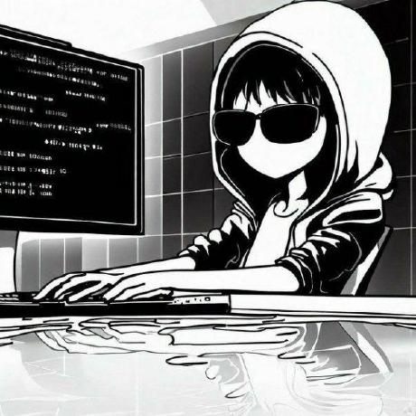

# TODO List Tasks

This is a mini class project

* **Why:**
This is a simple app to manage daily tasks
Today, due to the difficult conditions of life and many conflicts, it is possible to forget some of our work. This issue makes us sad, especially if it is an important task.
This program can help you better manage your tasks and not forget them in the sea of ​​problems.

* **About US:**
This project was created by the Underdogs team and ... more explanations by the team itself ... .

## How To Use

This program is in testing mode, but if you want to test our trial version, just go to the following address. 
[Version Beta 🔬](https://mhsaghsemii.github.io/ToDo-List/)

## Documentation
In this project, DOM generator was used to design and control DOM. 
Silver boxes are used to display messages to the user. 

Options:
1. Timer
2. Music Player

* [Sliver Box](https://github.com/Silverethical/silverBox)
* [DOM Generator](https://github.com/Silverethical/DOM-Generator/)
## Contributing
You can get help from the following sections and improve the Bama project

- Time and date management.
- Style of tasks.
- Optimize Music player.
- Process user-account manager.

## Our Team
&nbsp;&nbsp;&nbsp;&nbsp;&nbsp;
&nbsp;&nbsp;&nbsp;&nbsp;&nbsp;
&nbsp;&nbsp;&nbsp;&nbsp;&nbsp;
